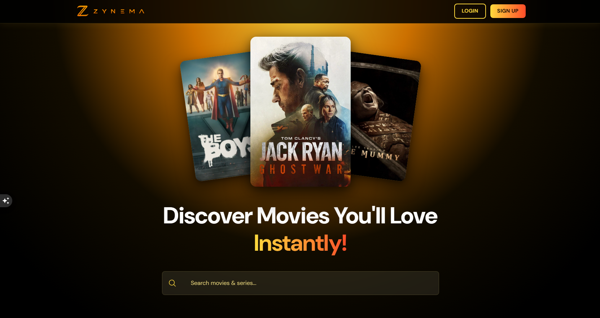
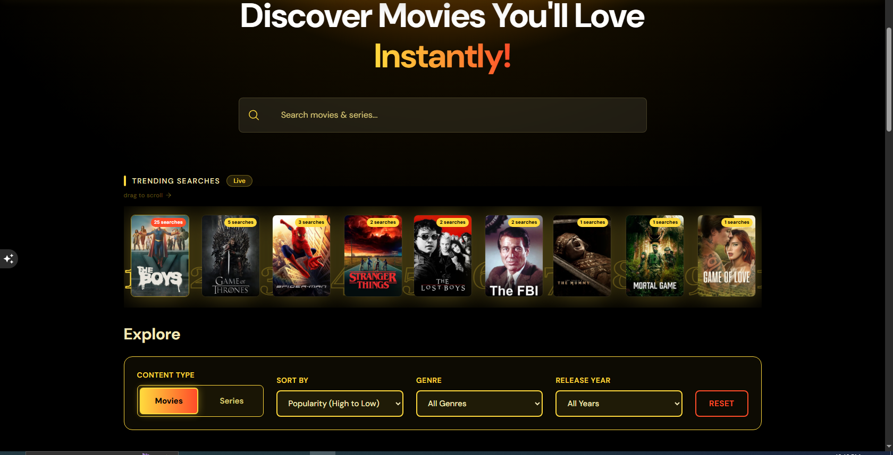
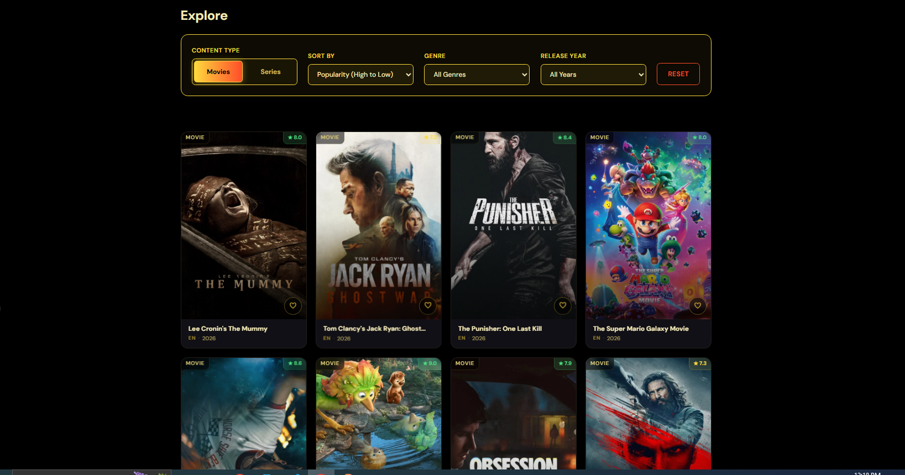
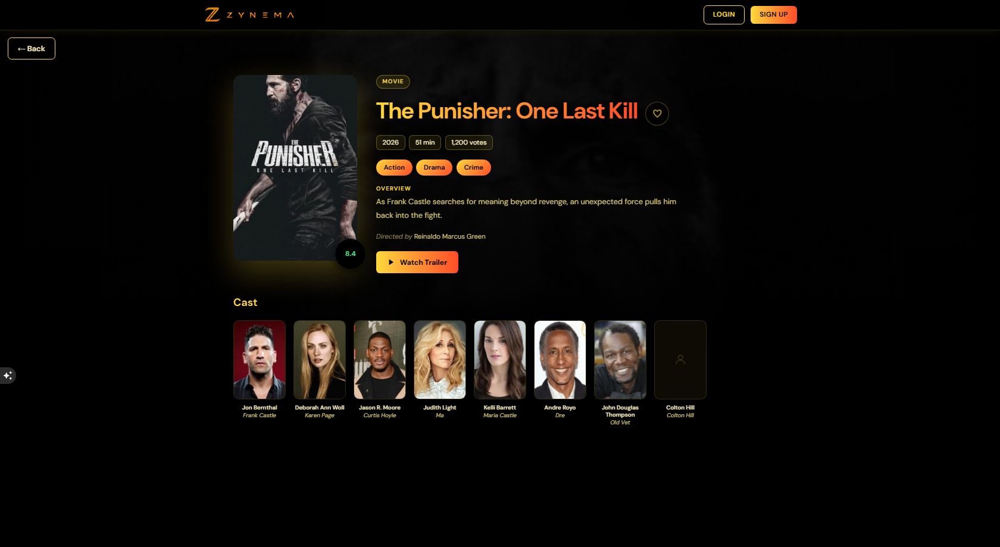
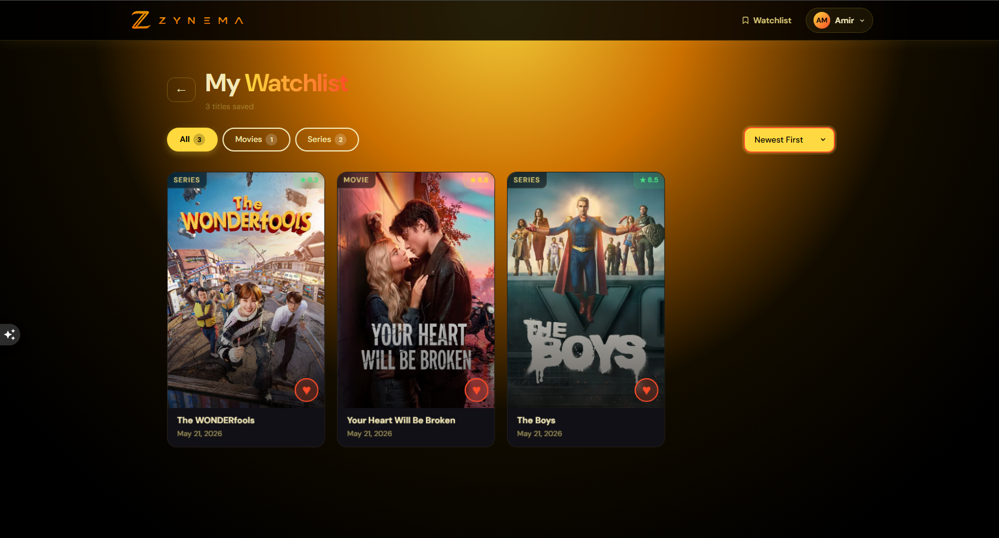
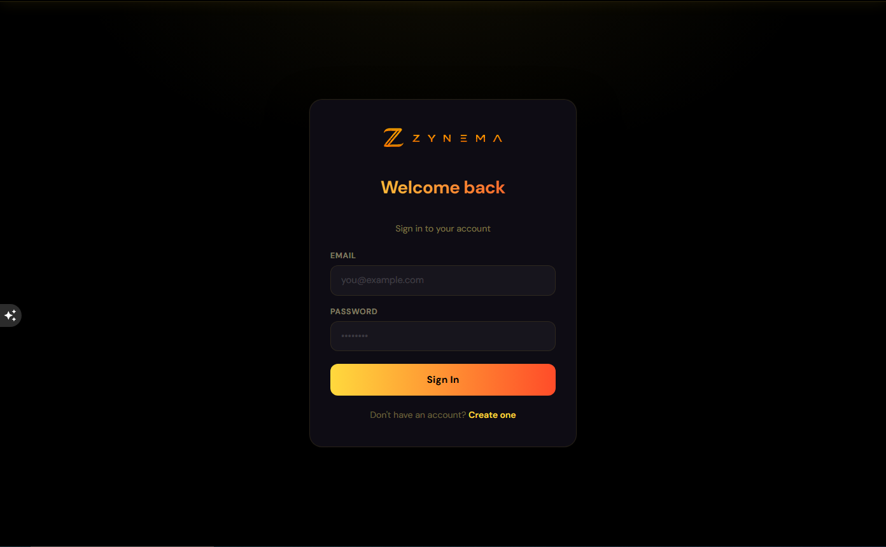
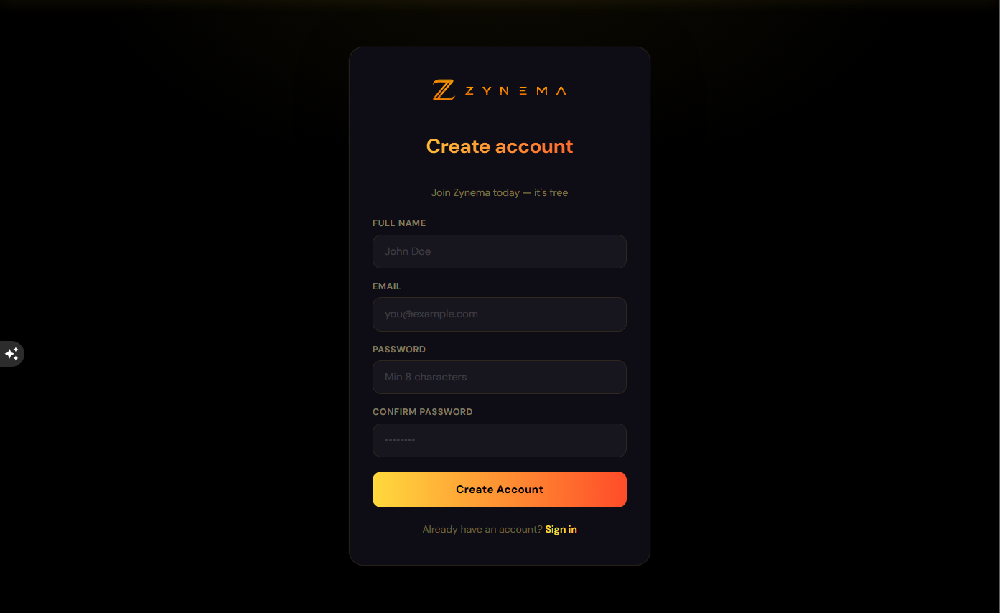

# Zynema — Movie & TV Discovery App

A React portfolio app to **discover movies and TV series**, **search** with debounce, **filter & sort** via TMDB, **sign in with Appwrite**, and save titles to a **personal watchlist**.


## Screenshots

### Home Page — Search & Discover



### Home Page — Trending & Filters



### Home Page With Cards



### Movie Details Page



### Watchlist Page



### Login Page



### SignUp Page



## Features

- Browse **movies** and **TV series** (discover + search)
- **Sort** by popularity, rating, release / first-air date
- **Genre** and **year** filters (media-specific genre lists from TMDB)
- **Trending searches** stored in Appwrite
- **Auth** — email/password sign-up & login (Appwrite)
- **Watchlist** — add/remove titles; filter & sort saved items
- **Code-split routes** — lazy-loaded pages for a smaller initial bundle

## Tech stack

| Layer   | Choice                         |
| ------- | ------------------------------ |
| UI      | React 19, React Router 7       |
| Build   | Vite 7                         |
| Styling | Tailwind CSS v4                |
| Data    | TMDB API, Appwrite (auth + DB) |
| HTTP    | Axios                          |

## Project structure

```
movie-app/
├── src/
│   ├── components/
│   │   ├── Routes/                    # Route guards & wrappers
│   │   │   ├── ProtectedRoute.jsx     # Auth-protected routes
│   │   │   ├── GuestRoute.jsx         # Guest-only routes
│   │   │   └── RouteLoading.jsx       # Loading state UI
│   │   ├── Header.jsx                 # Navigation navbar
│   │   ├── MovieCard.jsx              # Movie/Series card
│   │   ├── FilterSort.jsx             # Filter & sort controls
│   │   ├── Search.jsx                 # Debounced search
│   │   ├── Pagination.jsx             # Pagination component
│   │   ├── TrendingSearches.jsx       # Trending searches
│   │   ├── SkeletonCard.jsx           # Loading skeleton
│   │   ├── Spinner.jsx                # Loading spinner
│   │   ├── HeroPosterStack.jsx        # Hero section
│   │   └── Errorview.jsx              # Error display
│   │
│   ├── pages/
│   │   ├── HomePage.jsx               # Main discovery page
│   │   ├── Auth/
│   │   │   ├── LoginPage.jsx          # Login form
│   │   │   └── SignUpPage.jsx         # Registration form
│   │   ├── Details/
│   │   │   └── MovieDetailsPage.jsx   # Movie/TV details
│   │   ├── Watchlist/
│   │   │   └── WatchlistPage.jsx      # User's watchlist
│   │   └── NotFound/
│   │       └── NotFoundPage.jsx       # 404 error page
│   │
│   ├── context/
│   │   ├── AuthContext.jsx            # Authentication state
│   │   └── WatchlistContext.jsx       # Watchlist state
│   │
│   ├── services/
│   │   ├── authService.js             # Auth API calls
│   │   └── movieService.js            # TMDB API calls
│   │
│   ├── utils/
│   │   └── sessionStorageManager.js   # Session storage
│   │
│   ├── lib/
│   │   ├── tmdb.js                    # TMDB helpers
│   │   └── watchlistKeys.js           # Watchlist utilities
│   │
│   ├── App.jsx                        # Main app component
│   ├── App.css                        # App styles
│   ├── index.css                      # Global styles
│   ├── index.components.css           # Component styles
│   ├── appwrite.js                    # Appwrite database ops
│   ├── axiosConfig.js                 # Axios setup
│   └── main.jsx                       # Entry point
│
├── docs/
│   └── screenshots/                   # Project screenshots
│       ├── home.png
│       ├── home2.PNG
│       ├── home3.PNG
│       ├── details.PNG
│       └── watchlist.PNG
│
├── public/
│   └── zynema.svg                     # App logo
│
├── .env.example                       # Environment template
├── package.json                       # Dependencies
├── vite.config.js                     # Vite config
├── tailwind.config.js                 # Tailwind config
├── postcss.config.js                  # PostCSS config
├── jsconfig.json                      # JS path aliases
└── README.md                          # This file
```

## Environment variables

Copy `.env.example` to `.env` (or `.env.local`):

| Variable            | Description                                          |
| ------------------- | ---------------------------------------------------- |
| `VITE_TMDB_API_KEY` | TMDB v4 read access token                            |
| `VITE_APPWRITE_*`   | Appwrite endpoint, project, database, collection IDs |

> For a portfolio/demo, the TMDB key is used from the client via Vite env vars. Do not commit `.env` to git.

## Scripts

| Command           | Description                |
| ----------------- | -------------------------- |
| `npm run dev`     | Start Vite dev server      |
| `npm run build`   | Production build → `dist/` |
| `npm run preview` | Preview production build   |

### Development

```bash
npm install
cp .env.example .env
# Add VITE_TMDB_API_KEY and Appwrite IDs

npm run dev
```

Open [http://localhost:5173](http://localhost:5173).

## Appwrite setup (summary)

See collections in previous docs: **trending searches** + **watchlist**, with permissions so users only access their own watchlist rows.

## License

Private portfolio project.
